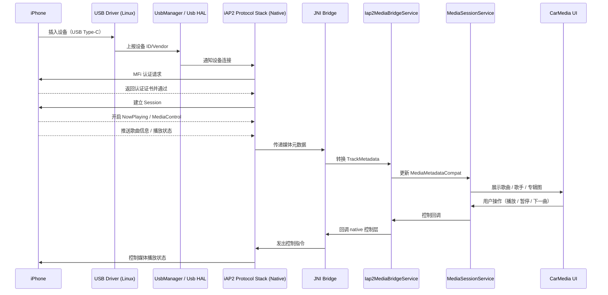

```mermaid
sequenceDiagram
    participant iPhone
    participant USB Driver (Linux)
    participant UsbManager / Usb HAL
    participant iAP2 Protocol Stack (Native)
    participant JNI Bridge
    participant Iap2MediaBridgeService
    participant MediaSessionService
    participant CarMedia UI

    iPhone->>USB Driver (Linux): 插入设备（USB Type-C）
    USB Driver (Linux)->>UsbManager / Usb HAL: 上报设备 ID/Vendor
    UsbManager / Usb HAL->>iAP2 Protocol Stack (Native): 通知设备连接
    iAP2 Protocol Stack (Native)->>iPhone: MFi 认证请求
    iPhone-->>iAP2 Protocol Stack (Native): 返回认证证书并通过

    iAP2 Protocol Stack (Native)->>iPhone: 建立 Session
    iPhone-->>iAP2 Protocol Stack (Native): 开启 NowPlaying / MediaControl

    iPhone-->>iAP2 Protocol Stack (Native): 推送歌曲信息 / 播放状态
    iAP2 Protocol Stack (Native)->>JNI Bridge: 传递媒体元数据
    JNI Bridge->>Iap2MediaBridgeService: 转换 TrackMetadata
    Iap2MediaBridgeService->>MediaSessionService: 更新 MediaMetadataCompat
    MediaSessionService->>CarMedia UI: 展示歌曲 / 歌手 / 专辑图

    CarMedia UI->>MediaSessionService: 用户操作（播放 / 暂停 / 下一曲）
    MediaSessionService->>Iap2MediaBridgeService: 控制回调
    Iap2MediaBridgeService->>JNI Bridge: 回调 native 控制层
    JNI Bridge->>iAP2 Protocol Stack (Native): 发出控制指令
    iAP2 Protocol Stack (Native)->>iPhone: 控制媒体播放状态

```
